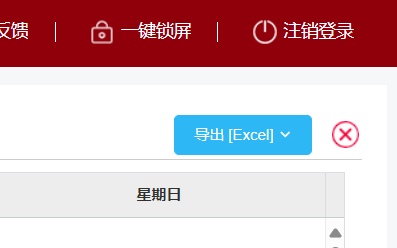
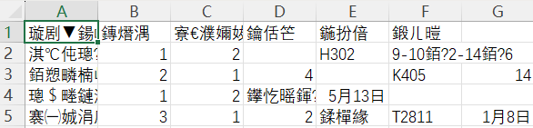

# 哈工大（深圳）课表转换为WakeUp课程表格式
## 简介
目前WakeUp课程表不支持从哈深教务直接导入，且iOS用户无法安装hita，导入课表需要手输很不方便，因此开发此简易脚本用于将本研导出的excel格式课表转换为WakeUp软件使用的csv格式。该程序不需要获取你的学号和密码，同时不会上传你的api key，结构简单，不存在安全风险。在使用此脚本之前，你需要以下技能：
1. 了解python程序的运行和环境搭建
2. 了解如何通过api key调用GPT

## 安装
执行以下命令，即可自动安装所需的包

    pip install -r requirements.txt

## 使用
1. 登录本研，点开首页左侧的课表，随后点击右上角蓝色`导出[Excel]`，下载export.xlsx文件至此文件夹内
2. 打开`classTable.py`，设置`BASE_URL`和`API_KEY`，有关如何使用api访问GPT的教程在此不作说明
3. 运行该程序，直到出现Finished!字样，将输出的class.csv文件导入WakeUp即可

    python classTable.py

## 注意
1. 由于此程序使用LLM进行转换，难免会发生格式错误，因此如果软件提示无法导入请自行检查错误并修正
2. 保存的csv采用utf-8编码，用Excel打开可能会出现如图所示的乱码，不用担心，这不是导出错误，WakeUp可以识别
3. 因为LLM具有不确定性，**因此请务必仔细检查导出课表与实际课表是否一致**，因课表转换出现错误导致旷课，本人概不负责🤗